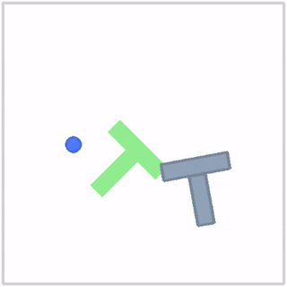

# flow_matching_policy
Flow Matching For Robot Policy

## Setup

Requires [`uv`](https://docs.astral.sh/uv/) and Python >=3.12.

```bash
# Create the virtual environment (once)
uv venv --python 3.12

# Install/sync dependencies (torch, lerobot[pusht,training,diffusion], this package, etc.)
uv sync

# Activate the environment
source .venv/bin/activate
```

Once activated, `python`, `lerobot-train`, and `lerobot-eval` resolve to the venv's versions. To leave the environment, run `deactivate`.

Alternatively, skip activation and prefix one-off commands with `uv run` (e.g. `uv run lerobot-train ...`), which resolves against `.venv` automatically.

Verify the setup:

```bash
python -c "import torch, lerobot; print(torch.__version__, torch.cuda.is_available(), lerobot.__version__)"
```

## PushT experiments



*A successful rollout (episode 0 of the n=200 eval below) of the flow_matching policy pushing the T-block into the target zone.*

The Flow Matching policy is benchmarked against the [`lerobot/diffusion_pusht`](https://huggingface.co/lerobot/diffusion_pusht) reference checkpoint at an equal training budget (200,000 steps, batch 64), with checkpoint selection matching the baseline's own methodology (best of periodic in-training rollout evals, not just the final step):

| | Flow Matching (this policy, 175k-step checkpoint) | `diffusion_pusht` (published) |
|---|---:|---:|
| Success rate | **73.5%** (n=200, 95% CI [67.4, 79.6]) | 65.4% (n=500) |
| Avg. max overlap ratio | 0.928 | 0.955 |
| Training steps | 200,000 | 200,000 |
| Inference steps per action chunk | 10 (forward-Euler ODE) | ~100 (DDPM) |

Read this as **parity, with a possible modest edge, not a clearly-established win** (p ≈ 0.038 vs. the baseline's own published number, one comparison among several run during the investigation). The best-supported claim is on efficiency: the same success rate is reached with **10 ODE integration steps instead of ~100 DDPM steps**, and separately, **50,000 training steps already matches 200,000** (once a training-window configuration bug was fixed) — 4x less training compute for a statistically indistinguishable result.

The trained checkpoint is published at [ameyawagh555/flow_matching_pusht](https://huggingface.co/ameyawagh555/flow_matching_pusht). The full investigation — including two config bugs that initially made this policy look roughly half as good as the baseline, and a benchmark of alternative ODE solvers (Heun, RK4) that found forward-Euler remains the best choice on this checkpoint — is written up in [`docs/comparison_pusht.md`](docs/comparison_pusht.md).

## Evaluate the pretrained diffusion_pusht baseline

`lerobot/diffusion_pusht` predates lerobot's processor-pipeline normalization format, so it needs a
one-time local prep step before `lerobot-eval` can load it (see the script's docstring for why):

```bash
python scripts/prepare_diffusion_pusht_checkpoint.py   # writes models/diffusion_pusht_local/
scripts/eval_pretrained.sh                             # eval + save rollout videos
```

`scripts/eval_pretrained.sh [POLICY_PATH] [ENV_TYPE] [N_EPISODES] [OUTPUT_DIR]` wraps `lerobot-eval` and
defaults to evaluating `models/diffusion_pusht_local` on `pusht` for 10 episodes. Rollout videos are
saved to `<output_dir>/videos/` automatically (up to 10 episodes) — no extra flags needed.

## Development

Dev tools (ruff, mypy, interrogate, pre-commit) live in the `dev` extra, not the base install:

```bash
uv sync --extra dev
uv run pre-commit install       # one-time: runs the checks below on every `git commit`
uv run pre-commit run --all-files
```

- **ruff** — lint (`ruff-check`) + format (`ruff-format`)
- **mypy** — static type checking (`[tool.mypy]` in `pyproject.toml`)
- **interrogate** — docstring coverage, minimum 80% (`[tool.interrogate]` in `pyproject.toml`)
