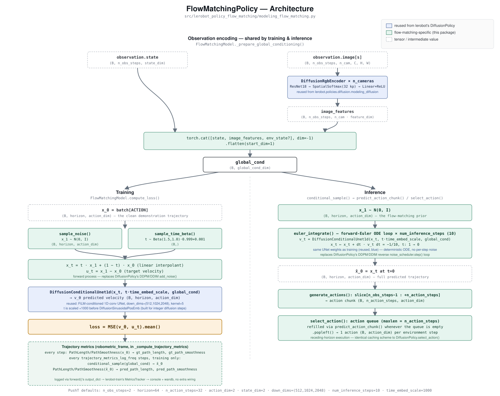

# Architecture

`FlowMatchingPolicy` (`src/lerobot_policy_flow_matching/modeling_flow_matching.py`) is architecturally
identical to lerobot's `DiffusionPolicy` — same vision encoder, same 1D-conv UNet, same receding-horizon
action-chunk execution — with one deliberate change: the generative process. Diffusion's discrete-time
denoising (DDPM/DDIM forward-diffusion + a learned reverse `noise_scheduler.step()` loop) is replaced with
continuous-time flow matching (a linear interpolant forward process + a deterministic forward-Euler ODE
reverse loop). Keeping everything else identical is what makes the two policies directly comparable on the
same task (see `plan.md`'s "Comparison vs. `lerobot/diffusion_pusht`").

## Shared observation encoding

Both training and inference start the same way, in `FlowMatchingModel._prepare_global_conditioning()`:
each camera's `observation.image` goes through a `DiffusionRgbEncoder` (a ResNet-18 backbone, truncated
before its pooling/classification head, followed by a `SpatialSoftmax` over 32 keypoints and a
`Linear`+`ReLU`) — imported directly from `lerobot.policies.diffusion.modeling_diffusion`, not vendored.
The resulting per-camera feature vectors are concatenated with `observation.state` (and
`observation.environment_state`, if present) across the `n_obs_steps` observation history and flattened
into a single `global_cond` tensor. This is the conditioning signal fed into the UNet on every subsequent
step, in both the training and inference paths.

## Training — `FlowMatchingModel.compute_loss()`

Given a clean action-chunk trajectory `x_0` from the dataset (shape `(B, horizon, action_dim)`):

1. Sample noise `x_1 ~ N(0, I)` and a training timestep `t ~ Beta(1.5, 1.0) · 0.999 + 0.001` (the
   openpi/pi0 convention, via `lerobot.policies.common.flow_matching.sample_noise`/`sample_time_beta`).
2. Form the **linear interpolant** `x_t = t·x_1 + (1−t)·x_0` and the **target velocity**
   `u_t = x_1 − x_0` — this is the entire forward process, and it's what replaces DiffusionPolicy's
   `noise_scheduler.add_noise()`.
3. Run the reused `DiffusionConditionalUnet1d` on `(x_t, t·time_embed_scale, global_cond)` to predict a
   velocity `v_θ`. `t` is scaled by `time_embed_scale` (1000, by default) before it reaches
   `DiffusionSinusoidalPosEmb`, because that embedding was built for integer diffusion timesteps in
   `[0, num_train_timesteps)` — fed a raw `t ∈ (0, 1)` directly, its higher-frequency channels never
   complete a full period and most of its capacity goes unused. This is the one place the reused UNet
   needed a (config-only, zero-code) adaptation rather than a straight drop-in.
4. `loss = MSE(v_θ, u_t)`, optionally masked by `action_is_pad` for dataset-boundary padding.

## Inference — `conditional_sample()` → `predict_action_chunk()` / `select_action()`

Sampling starts from pure noise `x_1 ~ N(0, I)` and integrates the learned velocity field backward from
`t=1` to `t=0` via `lerobot.policies.common.flow_matching.euler_integrate()`:
`x_t ← x_t + dt·v_t` with `dt = −1/num_inference_steps` (10 steps by default, vs. DiffusionPolicy's ~100
DDPM steps) — the same UNet weights as training, called repeatedly with decreasing `t`. Unlike DDPM/DDIM
ancestral sampling, this loop is deterministic: no per-step noise injection, just ODE integration.

The resulting full-horizon trajectory `x̂_0` is sliced to the `n_action_steps` actually meant to be
executed (`generate_actions()`), and `select_action()` manages the same receding-horizon action queue as
`DiffusionPolicy.select_action()`: `n_obs_steps` observations are cached, a `horizon`-length chunk is
generated once the action queue empties, and one action is popped per environment step.

## Trajectory-quality monitoring — `_compute_trajectory_metrics()`

Every `compute_loss()` call also computes `PathLength`/`PathSmoothness` (from `robometric_frame`) over the
ground-truth action chunk — cheap, since the tensor is already in hand. Every
`trajectory_metrics_log_freq` steps (default 200, matching `lerobot-train`'s own `log_freq`), and only
while `self.training` (never during the periodic offline eval-loss pass), it additionally runs a full
`conditional_sample()` and computes the same two metrics on the model's *own* predicted trajectory. Both
sets of numbers land in `forward()`'s `output_dict`, which `lerobot-train`'s `update_policy()` feeds
straight into its `MetricsTracker` — console and wandb logging come for free, no extra wiring. Watching
`pred_path_length`/`pred_path_smoothness` converge toward `gt_path_length`/`gt_path_smoothness` over
training is a trajectory-shape view of learning progress, independent of the raw loss value (see the M2/M3
runs in `checklist.md` for a real example: a 30-step smoke run had `pred_path_length≈110` against
`gt_path_length≈1.9`; by step 30,000 they'd converged to `1.84` and `1.92` respectively).

## What's reused vs. new

| Component | Status |
|---|---|
| `DiffusionRgbEncoder` (ResNet18 + SpatialSoftmax + Linear) | reused, unmodified |
| `DiffusionConditionalUnet1d` (FiLM-conditioned 1D-conv UNet) | reused, unmodified |
| Forward process (linear interpolant vs. DDPM `add_noise`) | new |
| Reverse process (`euler_integrate` vs. `noise_scheduler.step`) | new |
| Receding-horizon queues / `select_action` execution scheme | reused pattern, reimplemented (no shared code with `DiffusionPolicy`, since it's a different class, but line-for-line equivalent logic) |
| Trajectory-quality metrics (`robometric_frame`) | new |

No `diffusers` dependency anywhere in this policy — the only two things `diffusers` is used for in
`DiffusionPolicy` (`DDPMScheduler`/`DDIMScheduler`) don't exist here at all.
